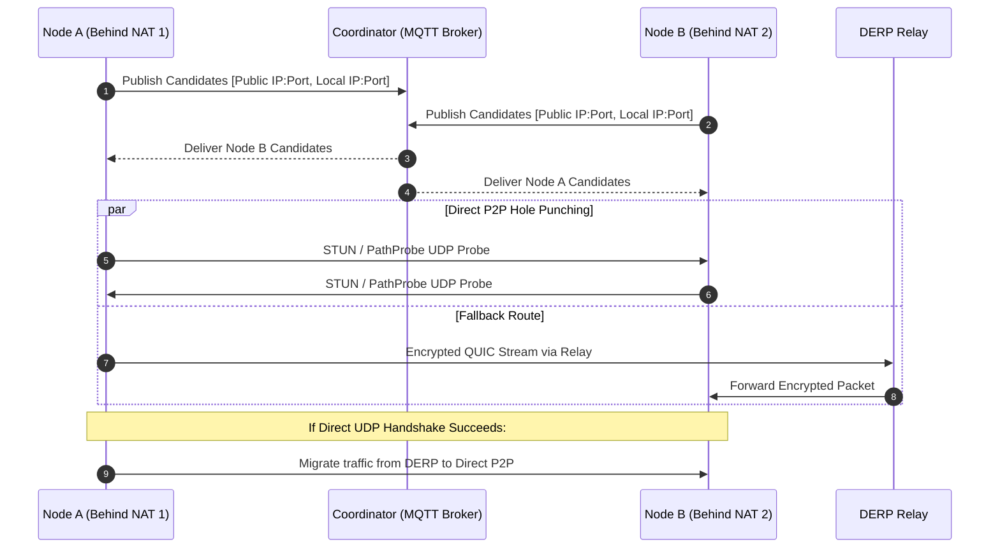

# oxide-mesh-net: Detailed System Design Specification (SDD)

**Document Version:** 1.0.0  
**Status:** Canonical  
**Author:** Oxide Networking Architecture Group  
**Target Platform:** Linux, macOS, Windows (Pure Rust, 2024 Edition)

---

## 1. High-Level Architecture & Component Taxonomy

```
+-----------------------------------------------------------------------------------+
|                                  oxide-daemon                                     |
|                                                                                   |
|  +--------------------+   +--------------------+   +---------------------------+  |
|  |    oxide-tun       |   |     oxide-acl      |   |      oxide-transport      |  |
|  | Multi-Queue TUN/TAP|-->| Zero-Trust Packet  |-->| QUIC Datagram Engine      |  |
|  | Lockless Queues    |   | Filter & Router    |   | RSS UDP Sockets           |  |
|  +--------------------+   +--------------------+   +---------------------------+  |
|            ^                        ^                            ^                |
|            |                        |                            |                |
|  +--------------------+   +--------------------+   +---------------------------+  |
|  |     oxide-dns      |   |    oxide-crypto    |   |     oxide-protocol        |  |
|  | MagicDNS Engine    |   | ChaCha20 / X25519  |   | Zero-Copy Wire Envelopes  |  |
|  | Split-Horizon Fwd  |   | Ed25519 Identity   |   | SIMD Serialization        |  |
|  +--------------------+   +--------------------+   +---------------------------+  |
+-----------------------------------------------------------------------------------+
                                      |
                     MQTT Signaling / QUIC Control Streams
                                      v
+-----------------------------------------------------------------------------------+
|                             oxide-coordinator                                     |
|  +---------------------------+  +----------------------+  +--------------------+  |
|  | Actix Web API Engine      |  | Embedded MQTT Broker |  | SurrealDB Storage  |  |
|  | OIDC Auth / Device Enroll |  | rumqttd Mesh Fabric  |  | State & Topology   |  |
|  +---------------------------+  +----------------------+  +--------------------+  |
+-----------------------------------------------------------------------------------+
```

---

## 2. Wire Protocol & Envelope Framing Design

All packets traversing the overlay mesh are encapsulated in the zero-copy binary wire envelope defined in `oxide-protocol`.

### 2.1 Binary Framing Format

```
 0                   1                   2                   3
 0 1 2 3 4 5 6 7 8 9 0 1 2 3 4 5 6 7 8 9 0 1 2 3 4 5 6 7 8 9 0 1
+-+-+-+-+-+-+-+-+-+-+-+-+-+-+-+-+-+-+-+-+-+-+-+-+-+-+-+-+-+-+-+-+
|  Magic (0x58) | Version (0x01)|   Msg Type    |     Flags     |
+-+-+-+-+-+-+-+-+-+-+-+-+-+-+-+-+-+-+-+-+-+-+-+-+-+-+-+-+-+-+-+-+
|                         Session ID                            |
+-+-+-+-+-+-+-+-+-+-+-+-+-+-+-+-+-+-+-+-+-+-+-+-+-+-+-+-+-+-+-+-+
|                      Sequence Number (u64)                    |
|                                                               |
+-+-+-+-+-+-+-+-+-+-+-+-+-+-+-+-+-+-+-+-+-+-+-+-+-+-+-+-+-+-+-+-+
|                     Initialization Vector (IV)                |
|                              (96-bit)                         |
+-+-+-+-+-+-+-+-+-+-+-+-+-+-+-+-+-+-+-+-+-+-+-+-+-+-+-+-+-+-+-+-+
|                         Payload Length                        |
+-+-+-+-+-+-+-+-+-+-+-+-+-+-+-+-+-+-+-+-+-+-+-+-+-+-+-+-+-+-+-+-+
|                   Encrypted Payload (Variable)                |
|                              ...                              |
+-+-+-+-+-+-+-+-+-+-+-+-+-+-+-+-+-+-+-+-+-+-+-+-+-+-+-+-+-+-+-+-+
|                   Authentication Tag (128-bit)                |
|                              (Poly1305 / GCM)                 |
+-+-+-+-+-+-+-+-+-+-+-+-+-+-+-+-+-+-+-+-+-+-+-+-+-+-+-+-+-+-+-+-+
```

### 2.2 Message Types & Enums
- `0x01 - DataIpv4`: Encapsulated IPv4 packet payload.
- `0x02 - DataIpv6`: Encapsulated IPv6 packet payload.
- `0x03 - KeepAlive`: Liveness check and path heartbeat.
- `0x04 - PathProbe`: Round-trip latency and path quality measurement probe.
- `0x05 - KeyExchange`: Ephemeral session re-keying and ratchet advancement.
- `0x06 - ControlSignal`: Out-of-band coordination and peer migration command.

---

## 3. Data Plane: Multi-Queue TUN & Thread-per-Core Pipeline

### 3.1 Kernel Interfacing (`oxide-tun`)
- On Linux, virtual network interfaces are allocated using `IFF_TUN | IFF_NO_PI | IFF_MULTI_QUEUE`.
- One file descriptor per CPU core is opened, bound to dedicated worker threads pinned with `core_affinity`.
- Worker threads loop on non-blocking `recvmmsg` / `sendmmsg` buffers using zero-copy slice allocations from `bytes::BytesMut`.

### 3.2 Thread-per-Core Packet Processing Loop

```
  [ Multi-Queue TUN RX ]
            |
            v
  [ Zero-Copy Header Parse ] (Extracts src/dst IP, protocol, ports)
            |
            v
  [ ACL Evaluation Cache ]   (Lockless atomic Radix Tree lookup)
            |
      +-----+-----+
      | PASS      | DROP
      v           v
  [ Crypto Ratchet AEAD ]    (Encrypt payload with session symmetric key)
            |
            v
  [ Route & Peer Lookup ]    (Extract QUIC Connection Handle)
            |
            v
  [ RSS UDP Socket TX ]      (QUIC Unreliable Datagram RFC 9221)
```

---

## 4. Transport Plane: QUIC Datagrams & Hardware RSS Striping

### 4.1 Multiplexed QUIC Transport Architecture
- Implemented in `oxide-transport` using `quinn` with `rustls` (backed by `aws-lc-rs`).
- **Data Plane:** Layer-3 transit flows over QUIC Unreliable Datagrams (RFC 9221). Eliminates head-of-line blocking and double-congestion control.
- **Control Plane:** Multi-stream bidirectional channels over the same QUIC connection handle out-of-band signaling, telemetry, MagicDNS synchronization, and Oxide-SSH.

### 4.2 Multi-Port UDP RSS Striping
- Standard userspace VPNs bind a single UDP port, which confines all traffic to a single hardware RX ring on the NIC.
- `oxide-mesh-net` creates a striped pool of $N$ UDP sockets (where $N = \text{CPU cores}$).
- Outgoing packets are dynamically distributed across socket file descriptors based on a 4-tuple hash:
  $$\text{Socket Index} = \text{hash}(\text{src\_ip}, \text{dst\_ip}, \text{src\_port}, \text{dst\_port}) \pmod N$$
- This guarantees full NIC Receive Side Scaling (RSS) utilization across hardware queues.

---

## 5. Control Plane: Decentralized MQTT Signaling & NAT Traversal

### 5.1 Signaling Topology
- Built on `rumqttc` (client) and `rumqttd` (embedded high-throughput broker).
- Topics are structured hierachically:
  - `mesh/{mesh_id}/nodes/{node_id}/inbox`: Direct signaling for hole punching, route proposals, and session establishment.
  - `mesh/{mesh_id}/topology/broadcast`: Cluster-wide topology updates, node joins/leaves, and subnet route advertisements.
  - `mesh/{mesh_id}/keys/rotation`: Public key announcement and CRL revocations.

### 5.2 NAT Traversal & Hole Punching Sequence



---

## 6. Access Control (ACL) Engine & Microsegmentation

### 6.1 Declarative ACL Data Model
Rules are defined declaratively in TOML or JSON and compiled into high-speed evaluation bitmasks in `oxide-acl`:

```toml
[[rules]]
action = "accept"
src = ["tag:developers", "100.64.0.10"]
dst = ["tag:staging-servers:8080", "100.64.1.0/24:443"]
protocols = ["tcp", "udp"]

[[rules]]
action = "drop"
src = ["*"]
dst = ["tag:production-db:5432"]
```

### 6.2 Evaluation Strategy
- Rules are indexed in a lockless `dashmap` and IP prefix Radix Tree (`ipnet`).
- Flow results are cached in an atomic LRU cache for 100ns single-lookup execution on subsequent packets.

---

## 7. MagicDNS & Split-Horizon Resolution

### 7.1 DNS Interception Architecture (`oxide-dns`)
- An embedded DNS server binds to `100.100.100.100:53` (or system loopback).
- Intercepts queries ending in `.oxide.mesh` and returns internal overlay IPv4/IPv6 addresses directly from the node's local routing table.
- Upstream and corporate queries are forwarded to upstream nameservers defined in the node configuration with caching and DNSSEC validation.

---

## 8. Actix Web Architecture Standard

Across the entire workspace, HTTP services are exclusively built using `actix-web 4`:

### 8.1 Coordinator Endpoints
- `POST /api/v1/auth/enroll`: Device registration via Ed25519 signature verification or OIDC Bearer token.
- `GET /api/v1/mesh/map`: Fetch latest signed network map and peer list.
- `POST /api/v1/telemetry`: Node health, latency matrix, and throughput metrics ingestion.
- `GET /healthz`: Liveness and readiness probe.

### 8.2 Daemon Local Web & UI Server
- `oxide-daemon` embeds an Actix Web server on `127.0.0.1:9090`.
- Exposes administrative REST endpoints for `oxide-cli` and IPC.
- Serves the pre-compiled `oxide-ui` Dioxus WASM single-page application with gzip/brotli compression.

---

## 9. Error Handling & Memory Safety Invariants

- **Zero Panic Policy:** No production code may use `.unwrap()` or `.expect()` on runtime paths. All fallible operations must return `Result<T, OxideError>`.
- **Zero Raw Pointers:** Pure-Rust memory safety. Memory mapped buffers utilize `zerocopy` or `bytemuck` with strict compile-time alignment verification.
- **Constant-Time Crypto:** All cryptographic comparisons (HMAC, Auth Tags, Public Keys) must execute via `subtle::ConstantTimeEq` to prevent side-channel timing attacks.
